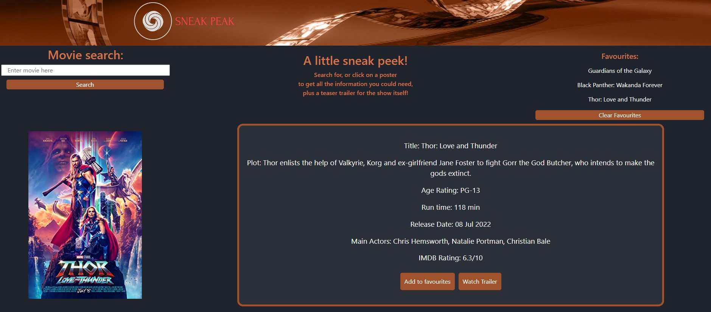

# Project-1-Sneak-Peak
A way to check information about a specific movie and recent releases.

## Description 

This is an easy to use movie information page. You can search for specific movies, or click on the available suggestions to get information about the selected movie and a link to the youtube trailer.

## Usage 

To use this website:
- Type in the text box, the movie you would like to get information for and click the search button.
- Alternatively you can click on one of the existing images.
- When you click either the search button or poster image, the data will be presented on screen.
- The movie poster on the left followed by the in formation and two buttons, the favourite button and the trailer button.
- Clicking the trailer button opens a web page to the youtube trailer.
- When clicking the favourite button, the movie will be stored in the favourite movie section to the right of the screen.
- The favourite movie section has a clear button which, when clicked, will empty the favourite movie list.
- You can keep searching and clicking as many times as desired.

(screenshot images below)

Main screen:
  

Searched Information:
  

Saved searches being stored on the right:
 

Link to active website: https://leanne-annable.github.io/Project-1-Sneak-Peak/

## Credits

This page was created as a collaboration between Leanne Annable and Talha Muhammad. 
We used the Fisher-Yates shuffle method to assist us with one of our functions.  
We offer thanks to our TA's Noah and Brittany for their assistance in helping us find solutions to technical issues. 
We used the API's from OMDB and YouTube to get the page working. 
We also used w3schools and stackOverflow as two main points of reference when querying different elements.

## License

This webpage is licenced under the MIT Licence

© 2023 edX Boot Camps LLC. Confidential and Proprietary. All Rights Reserved.